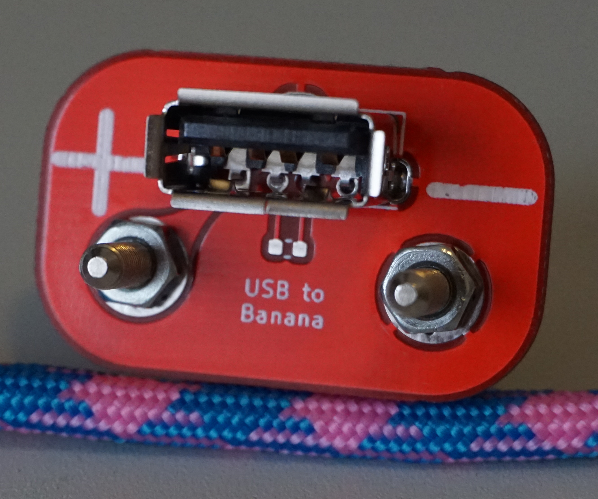

# Banana to USB Adaptor

  

PCB to adapt banana plugs found on most power supplies to a female USB A connector. 

## Parts Required
- 1 x Molex 105057-0001 USB Connnector [Mouser](https://www.mouser.com/ProductDetail/538-105057-0001) [Digikey](https://www.digikey.com/products/en?keywords=%20105057-0001%20)
- 2 x Screw in Banana Plugs [Mouser](https://www.mouser.com/ProductDetail/565-72918) [Digikey](https://www.digikey.com/product-detail/en/pomona-electronics/72918/501-1200-ND/1196334)
- Optional: 0603 resistor (max 200 ohms) to comply with USB Battery Charging Spec ([Rev 1.2, page 45](https://web.archive.org/web/20141006113700/http://www.usb.org/developers/docs/devclass_docs/BCv1.2_070312.zip))
